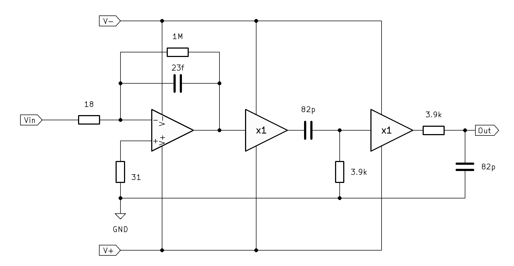
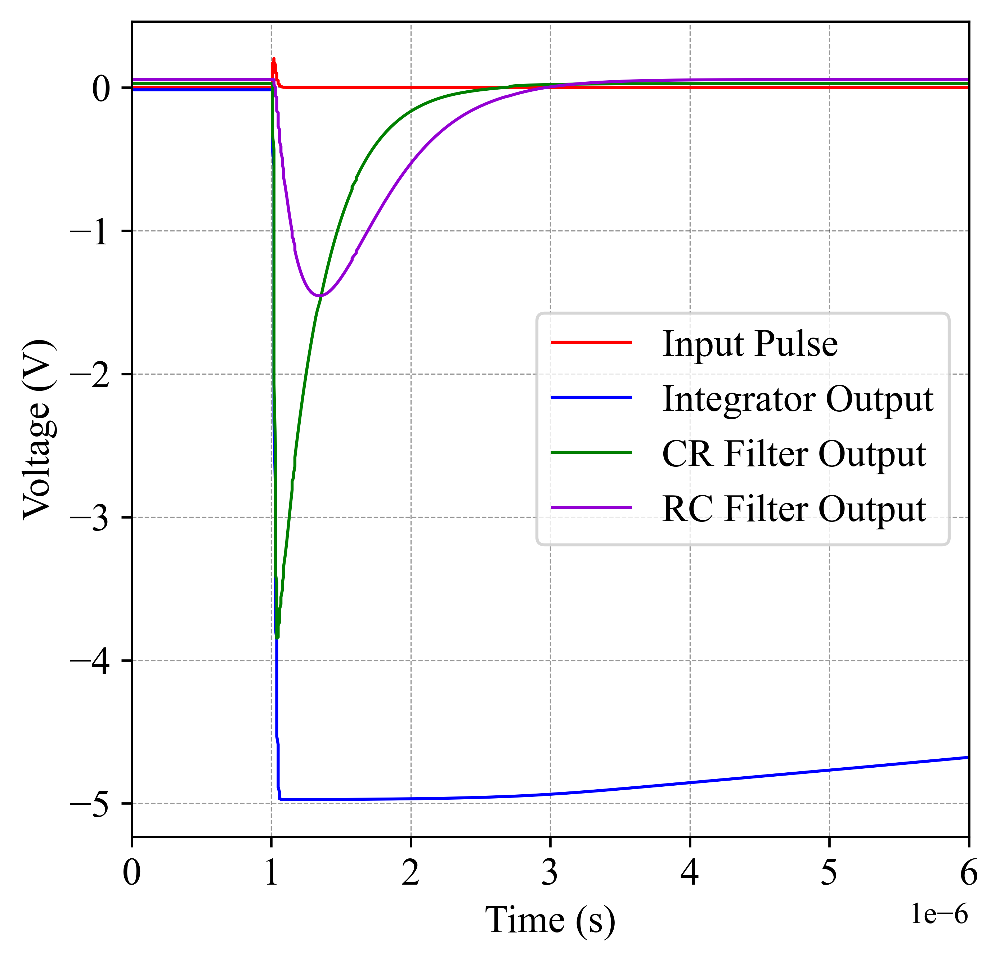
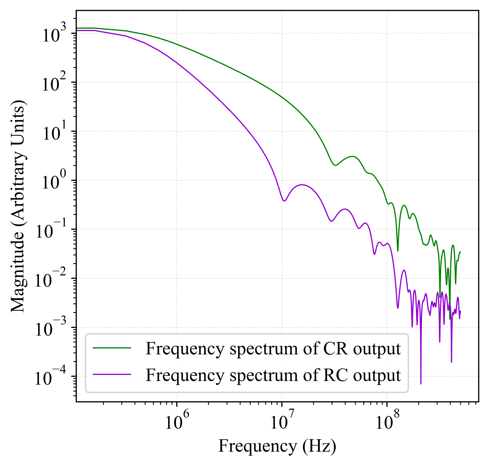

## Analogue Front-End Components
### Integration and Initial Shaping

The first stage of the analogue front end is to integrate the input charge with an active integrator. As established, the input signal must be amplified, and the integrator can achieve this
with RC values less than unity, according to,

$` V_{\text{out}} = -\frac{1}{RC}\int V_{\text{in}}\,dt`$.

The input charge will be proportional to
the energy of the detected particle, hence the integrator’s importance in particle identification.
The choice of capacitance is informed by the total charge injected from the simulated imput pulse. The
current can be obtained by dividing the equation of the simulated input,

$` V_{in}(t) = A\left\{\exp\left(-\frac{t}{\tau_1}\right) - \exp\left(-\frac{t}{\tau_2}\right)\right\}. `$,

with the resistance through which the the pulse will travel after being emitted by the diode. To generate the simulated pulse in reality, a test capacitor will have to discharge through a resistor to create the exponential envelope desired. An arbitrary value resistance is chose here, at 18 Ω, and the simulated pulse is apprxoimately 100 ns in duration as seen in the theory file. The charge injected into the circuit can be estimated by integrating the current over the pulse width, T = 100 ns,

$` Q_{\text{tot}} = \frac{1}{R}\int_{0}^{T} V_{\text{in}}\,dt\approx92\times10^{-15}\, \text{C} `$.

The op-amps and buffers discussed in the desin considerations operate at ±5 V which is therefore the
maximum output magnitude of the integrator. A small voltage drop would be seen such that
the true maximum output is slightly less, hence the capacitor value is chosen from Q/V , with
V slightly below 5 V. This means using a small ~25 ×10−15 F capacitor would be favourable,
with SMD models meeting this criteria. The small capacitance results in a short time constant,
meaning the integration is performed rapidly, creating a step-like output at the integrator.

To set the pulse width after the integrator, a high-pass CR filter follows, isolated by a buffer.
A decay constant is introduced, such that the pulse width is reduced to approximately five time
constants (where one time constant, τ is 320 ns in this design) of the CR filter, assuming that
the integration time is negligible [^1]. The integrator’s capacitor must fully discharge before another pulse from the diode arrives, since any remaining charge will introduce an offset on the integrated pulse and hence the output, providing artificially high voltages, and false particle identification. Placing a resistor in parallel with the integrating capacitor provides a controlled discharge path. It must have sufficiently large resistance such that on the time scale of the input pulse, the decay of the capacitor is negligible, and remains to appear step-like.

For the same reasons discussed in the theory section, the profile of the high-pass filter output is not
practical since the maximum amplitude is sharp and short in duration after introducing a decay
tail to the step input from the integrator. A low-pass filter is therefore introduced, with the
same time constant as the high-pass filter; these stages in addition to their outputs are illustrated below along with their Fourier transforms. 

|  |
|:--:| 
| KiCad schematic design of the first three components; the integrator, CR filter and the RC filter. |

|  |
|:--:| 
| Simulated output voltage signals for the first three stages of the design. The discharge of the integrator is slow, and its output appears step-like on the time scale of the input pulse. The CR filter sets the pulse width. |

|  |
|:--:| 
| Frequency spectra of the CR and RC filter outputs of the figure above. A larger dominance of lower frequency components is seen after passing through the low-pass, RC filter, broadening the sharp pulse outputted from the CR filter. |

As expected, the CR filter output has high frequency
components due to its sharp nature. These components are attenuated by the RC filter, where
their relative magnitudes drop by several orders at frequencies above 10 MHz, whilst the lower
frequency components are mostly unaffected and hence their more dominant contribution. It
is for these reason that the output becomes more smooth, since the reduced noise bandwidth
in the frequency domain results in an increased pulse width in the time domain from Fourier
theory [^2]. This further results in high frequency noise mixtures being attenuated early in the
circuit before propagating to the final output.
## Footnotes

[^1]: Shenkman AL. Transient analysis of electric power circuits handbook. Springer Science &
Business Media; 2006.

[^2]: Hoffman F. An introduction to Fourier theory. Extraído el. 1997;2.
