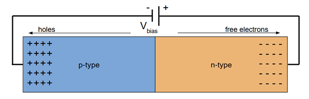
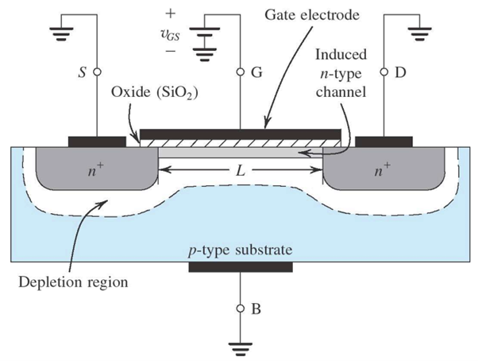
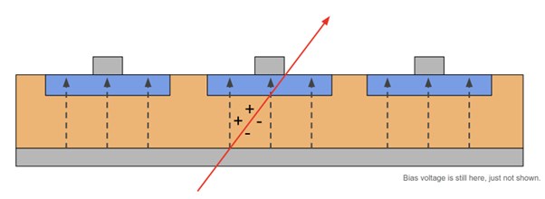
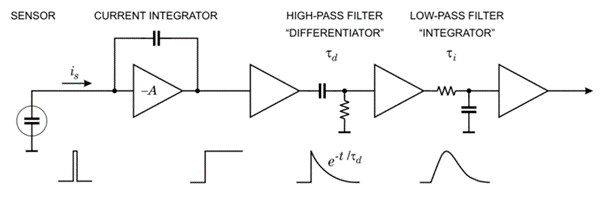

# Overview of Theory

## The Diode Pixel

Under reverse bias, a diode will output current when a charged particle traverses through the depletion region, though in reality, this is difficult to set up. A depletion length must be sufficiently wide that when multiple diodes are used, the probability of a particle interacting is non-negligible. A potentially suitable diode is a Zener diode which handles reverse breakdown voltage without damage and conducts a sizeable amount of reverse current. Below is a typical illustration of a diode under reverse bias with a depletion width in the centre.

A depletion width is seen in traditional CMOS technology used in advanced particle detectors. The image below from 'Microelectronic Circuits' by Sedra/Smith illustrates the depletion region seen in NMOS transistors.

The schematic below simply illustrates how a charged particle passing through the depletion region generates electron-hole pairs through the ionisation of electrons to the conduction band. A detectable current is achieved that is short in duration due to the small size of the system.

## The Front-End 

The front-end pulse shaper is needed to take the sharp output and transform the waveform into something measrable by a counter at the end which may, for example, detect the rising and falling edges of digital signals. The fundamentals of what the front-end should do is shown in 'Semiconductor Detector Systems' by Helmuth Spieler with the bassic schematic outline illustrated below.

## Assumptions for the Design

Before designing the circuitry, a representation of the output from the diode (current pulse) to the front-end must be established. The depletion width of a diode essentially contructs a capacitor system and so the output of the diode is expected to decay with an exponential waveform. Similar waveforms can be seen in other detector systems, such as the pulses from the anode in photomultiplier tubes. In reality, there is also a rise time to the pulse before the exponential decay commences which slightly reduces the sharpness of the pulse output from the diode. Considering all these factors, the following waveform may be considered appropriate.

