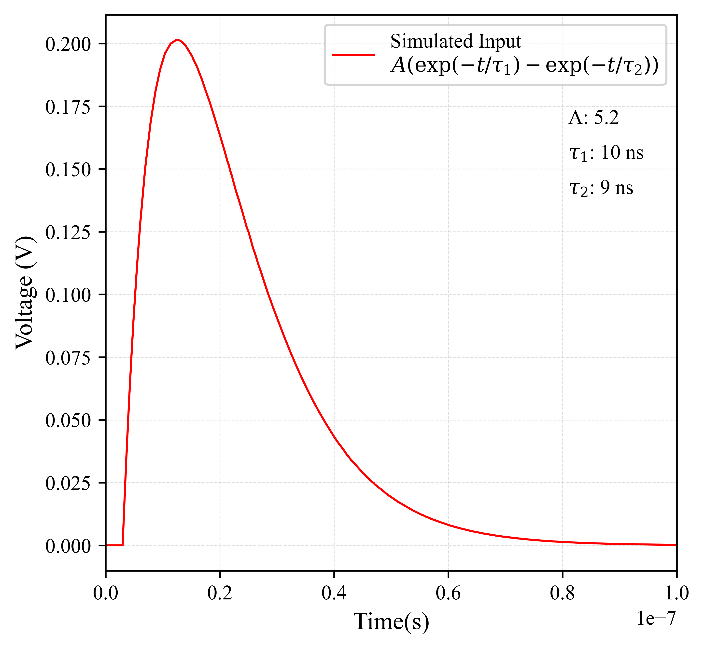

# Overview of Theory

## The Diode Pixel

Under reverse bias, a diode will output current when a charged particle traverses through the depletion region, though in reality, this is difficult to set up. A depletion length must be sufficiently wide that when multiple diodes are used, the probability of a particle interacting is non-negligible. A potentially suitable diode is a Zener diode which handles reverse breakdown voltage without damage and conducts a sizeable amount of reverse current. Below is a typical illustration of a diode under reverse bias with a depletion width in the centre.

A depletion width is seen in traditional CMOS technology used in advanced particle detectors. The image below from 'Microelectronic Circuits' by Sedra/Smith illustrates the depletion region seen in NMOS transistors.

The schematic below simply illustrates how a charged particle passing through the depletion region generates electron-hole pairs through the ionisation of electrons to the conduction band. A detectable current is achieved that is short in duration due to the small size of the system.

## The Front-End 

The front-end pulse shaper is needed to take the sharp output and transform the waveform into something measrable by a counter at the end which may, for example, detect the rising and falling edges of digital signals. The fundamentals of what the front-end should do is shown in 'Semiconductor Detector Systems' by Helmuth Spieler with the bassic schematic outline illustrated below.

## Assumptions and Design Considerations

Before designing the circuitry, a representation of the output from the diode (current pulse) to the front-end must be established. The depletion width of a diode essentially contructs a capacitor system and so the output of the diode is expected to decay with an exponential waveform. Similar waveforms can be seen in other detector systems, such as the pulses from the anode in photomultiplier tubes. In reality, there is also a rise time to the pulse before the exponential decay commences which slightly reduces the sharpness of the pulse output from the diode. Considering all these factors, the following waveform is appropriate,

$` V_{in}(t) = A\left\{\exp\left(-\frac{t}{\tau_1}\right) - \exp\left(-\frac{t}{\tau_2}\right)\right\}. `$

A plot of this waveform is shown below, constructed in Python. The pulse is 100 ns in duration with a peak voltage around 200 mV.

The analogue front-end shaping circuit must amplify the input signal to a measurable output
level, preferably on the order of volts, compared to the low mV range at the input. Practically,
this would allow for higher voltage thresholds to be set at the digitisation stage when outputting
high or low signals, which are easier to implement with potential dividers. Key characteristics
such as time over threshold would also be more easily determined due to a lesser influence of
noise. The time over threshold further encodes information regarding the particle that is detected, though this is currently beyond the scope of this project.

Sharp peaks, as seen in the simulated pulse above, are difficult to process since the maximum amplitude
is not maintained for a relatively long time [^1], hence the pulse should be widened such that
it is smoothened at the peak. The limit on the shaped pulse width should be determined by
the environment in which it will be used, since a pulse width longer than the time interval between subsequent detections would introduce stacked pulses and the need for deconvolution
post-processing, as demonstrated by E.M. Khilevitch et al. [^2].

An additional consideration is the slew rate of op amps. The internal structure of op amps
typically includes a compensation capacitor which reduces the unity-gain bandwidth such that
phase shifts occur beyond this frequency, outside the ideal operating parameters of the op amp
[^3]. This along with other phenomena introduce a slew rate, the upper limit on the rate of
change of the output. If the rate of change of voltage at the input signal is greater than the
op amp slew rate, the output rate of change of voltage would be restricted to the slew rate,
which causes distortion and an undesired increase in signal length. The expected input described above sees a rapid change of voltage with time and hence has high frequency components that would be seen from Fourier transforms. This leads one to immediately disregard some of the most common op amps such as the LM741 with a slew rate of 0.5 V /μs and a
1.5 MHz bandwidth [^4]. The op amp of choice in this project is the LMH6611 with a 0.1-dB
bandwidth of 45 MHz and a slew rate of 460 V /μs [^5]. This slew rate is sufficient for simulated pulse, yet may fall short when accepting the true diode signal which is currently unknown. Faster op amps such as
the OPA818 would excel, however their package form makes prototyping difficult, hence their
omission [^6].

## Footnotes
[^1]: Knoll GF. Radiation detection and measurement. John Wiley & Sons; 2010.
[^2]: Khilkevitch EM, Shevelev AE, Chugunov IN, Iliasova MV, Doinikov DN, Gin DB, et al.
[^3]: Horowitz P, Hill W, Robinson I. The art of electronics. vol. 2. Cambridge university press
Cambridge; 1989.
[^4]: LM741 data sheet, product information and support | TI.com; 2024. [Online; accessed 14.
Mar. 2024]. Available from: https://www.ti.com/product/LM741.
[^5]: LMH6611 data sheet, product information and support | TI.com; 2024. [Online; accessed
14. Mar. 2024]. Available from: https://www.ti.com/product/LMH6611.
[^6]: OPA818 data sheet, product information and support | TI.com; 2024. [Online; accessed
14. Mar. 2024]. Available from: https://www.ti.com/product/OPA818.
